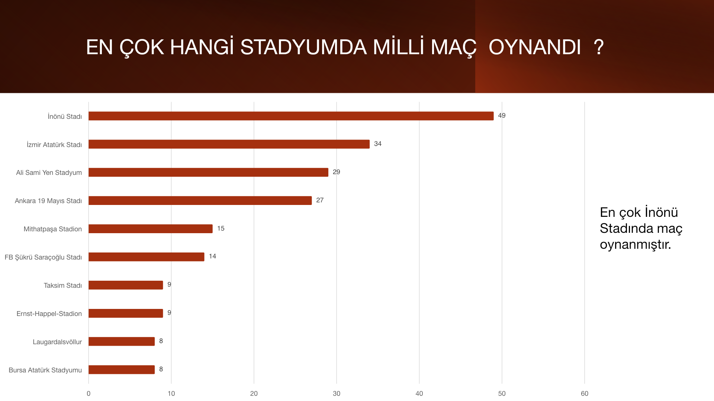
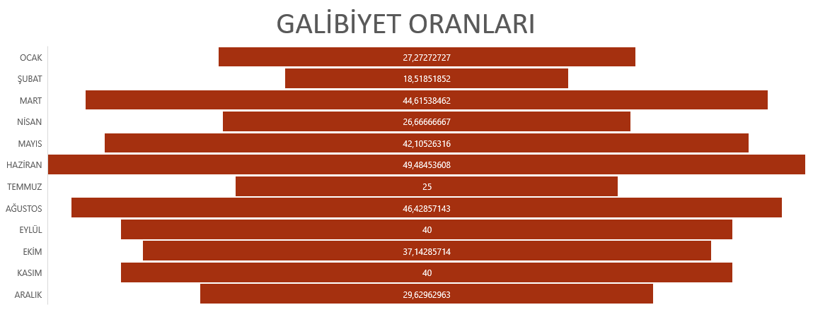

# Türkiye A Milli Takımı Maç Verileri Analizi

Türkiye A Milli Takımı'nın **635 maçını** Excel ile inceleyen veri analizi portföy projesi. Çalışma, maç sonuçlarını aylara, rakiplere, maçın oynandığı yerlere, teknik direktörlere ve hakem ülkelerine göre özetler. Bulgular 19 slaytlık PowerPoint sunumunda anlatılır.

**Veri kapsamı:** 26 Ekim 1923 – 14 Ekim 2024 · **Araçlar:** Microsoft Excel, Microsoft PowerPoint

[Excel analiz dosyası](data/qry_AMilliMac_Verileri.xlsx) · [Sonuç sunumu](presentation/A_MILLI_TAKIMI.pptx)

## Projenin amacı

Maç düzeyindeki verilerden anlaşılır performans özetleri üretmek ve araştırma sorularını ölçülebilir çıktılarla cevaplamak. Proje, PivotTable ile veri özetleme, galibiyet oranı hesaplama, grafik hazırlama ve bulguları sunumla anlatma becerilerini gösterir.

Sunumdaki talep formu verilerin TFF web sitesinden geldiğini belirtir. Repoda veri toplama kodu veya kaynak sayfaların ayrıntılı listesi bulunmaz. Buradaki kapsam ve sonuçlar, Excel dosyasında kayıtlı veriye dayanır. Veri 2024'te sona erer ve güncel milli takım istatistikleri olarak değerlendirilmemelidir.

## Öne çıkan sonuçlar

| Analiz | Dosyalarda bulunan sonuç | Excel'deki dayanak |
| --- | --- | --- |
| Genel maç sonuçları | 249 galibiyet, 148 beraberlik, 238 mağlubiyet. Galibiyet oranı **%39,21** | `Başarı Oranı!B17:F17` |
| En sık karşılaşılan rakipler | Romanya **26**, Bulgaristan **23**, Almanya **22** maç | `En Fazla Maç!A4:B6` |
| En yüksek aylık galibiyet oranları | Haziran **%49,48** (48/97), Ağustos **%46,43** (13/28), Mart **%44,62** (29/65) | `Başarı Oranı!A5:F16` |
| En düşük aylık galibiyet oranları | Şubat **%18,52** (5/27), Temmuz **%25,00** (2/8) | `Başarı Oranı!A6:F6`, `A11:F11` |
| En çok maç oynanan stadyumlar | İnönü Stadı **49**, İzmir Atatürk Stadı **34**, Ali Sami Yen Stadyum **29** maç | `En Fazla Maçın Oynandığı Stadyu!A4:B6` |
| En çok maç oynanan şehirler | İstanbul **146**, İzmir **38**, Ankara **29** maç | `En Fazla Maçın Oynandığı Kent!A4:B6` |
| Teknik direktör galibiyet oranları | En az 10 maçlık grupta Stefan Kuntz **%60,00**, Ersun Yanal **%53,33**, Fatih Terim **%53,17**, Vincenzo Montella **%52,94**, Şenol Güneş **%47,89** | `Direktör kac maç yendi yenildi!A5:G22`, slayt 11 |
| Yerli teknik direktör puan ortalamaları | Ersun Yanal **1,87** (15 maç), Fatih Terim **1,79** (126 maç), Şenol Güneş **1,70** (71 maç) | `YerliBaşarı1.1!M7:O9`, slayt 13 |
| Yabancı teknik direktör puan ortalamaları | Stefan Kuntz **1,95** (20 maç), Vincenzo Montella **1,76** (17 maç), Guus Hiddink **1,56** (16 maç) | `Yerli Yabancı Başarı!A4:C6`, slayt 14 |
| Hakem ülkelerine göre puan ortalamaları | Gösterilen ülkeler içinde Sırbistan **1,67** (15 maç), İspanya **1,65** (23 maç), İskoçya **1,64** (11 maç) | `Hakem Başarı!A4:C6`, slayt 15 |

Oranlar ve ortalamalar iki ondalığa yuvarlanmıştır. Temmuz gibi az maç içeren grupları değerlendirirken örneklem büyüklüğü dikkate alınmalıdır. Şehir/stadyum maç sayıları başarı oranı değildir. Hakem ülkeleri veya teknik direktörler arasındaki farklar tek başına neden-sonuç ilişkisi göstermez.

## Dashboard ve görsel çıktılar

Excel'deki **`Sayfa2`**, farklı analizlerin pivotlarını ve grafiklerini bir araya getiren toplu rapor/dashboard sayfasıdır. Ayrı analiz sayfaları ayrıntıları içerir. Çalışma kitabında toplam **17 PivotTable ve 22 grafik nesnesi** vardır. Bunların bir kısmı aynı analizin dashboard üzerindeki tekrarlarıdır.

### Stadyumlara göre maç sayıları



Mevcut PowerPoint'in 9. slaytından oluşturulmuş statik önizleme. İnönü Stadı 49 maçla ilk sıradadır. Yeni bir analiz veya yeniden tasarlanmış grafik değildir.

### Aylık galibiyet oranları



PowerPoint'in 8. slaydındaki gömülü PNG görseli değiştirilmeden çıkarılmıştır. Değerler yüzdedir ve `Başarı Oranı` sayfasındaki hesaplarla eşleşir. Görseller yalnızca maç istatistikleri içerir. Ayrıntılı ve düzenlenebilir grafikler için özgün dosyaları açın.

## Veri yapısı

`qry_AMilliMac_Verileri` sayfasında ilk satır başlıklardır. **`A2:BJ636` aralığında 635 maç ve 62 alan** bulunur. Her satır bir maçtır. `MacID` değerleri benzersizdir ve kayıtlar en yeni maçtan en eski maça doğru sıralanır.

| Alan grubu | Örnek sütunlar | İçerik |
| --- | --- | --- |
| Maç ve zaman | `MacID`, `MacTarihi`, `MacSaat`, `MacAy`, `MacYili` | Maç kimliği ve tarih bilgileri |
| Rakip ve organizasyon | `RakipUlke`, `RakipKonfederasyon`, `TurnovaIsim` | Rakip ve turnuva kategorileri |
| Sonuç ve puan | `MacSonucTuru`, `MacSonucu`, `IlkYari`, `TurkiyeMacSonucu`, `RakipMacSonucu`, `TurkiyePuan` | Sonuç sınıfı, skor ve kaydedilmiş puan |
| Saha ve seyirci | `MacSahasi`, `MacinOynandigiSehir`, `MacinOynandigiStad`, `StadKapasitesi`, `MacSeyirciSayisi` | Maçın oynandığı yer ve seyirci bilgileri |
| Teknik direktör ve hakem | `Direktor`, `DirektorUlkeID`, `DirectorUlke`, `DirektorOrtalamaPuan`, `Hakem`, `HakemUlke` | Performans karşılaştırmalarında kullanılan kategoriler |
| Diğer kayıtlı alanlar | Kart sayıları, FIFA sıralamaları, takım yaşı ve takım değeri | Dosyada mevcut; ayrı tamamlanmış analizler olarak sunulmamıştır |

Kaynak veriler hücre aralığında saklanır. Çalışma kitabında yapılandırılmış bir **Excel Table** nesnesi yoktur. Mevcut **PivotTable** nesneleri bu veri aralığını özetler.

## Kullanılan Excel teknikleri ve metrikler

- **PivotTable:** Ay/sonuç ve teknik direktör/sonuç çapraz tabloları, rakip/şehir/stadyum sayımları, puan ortalamaları ve teknik direktör ülkesi filtreleri.
- **İlk 10 filtresi ve sıralama:** Rakip, stadyum ve şehir pivotlarında kullanılmıştır. Eşit sayılar nedeniyle ilk 10 filtresi rakip tablosunda 12 ülke, şehir tablosunda 11 şehir gösterir.
- **PivotChart ve normal grafikler:** Sütun/çubuk, 3B sütun ve çizgi grafikleri. Puan ortalamaları ile galibiyet oranları farklı grafiklerde gösterilir.
- **Hücre formülleri:** `Başarı Oranı!F5` için `=(C5/E5)*100`; teknik direktör oranları için `Direktör kac maç yendi yenildi!G5` hücresinde `=(B5/E5)*100`. Oranlar 0–100 ölçeğinde tutulur.
- **Birleştirilmiş raporlama:** `Sayfa2` üzerindeki özetler, PowerPoint'teki bulgular ve önerilerle sunulur.

**Galibiyet oranı:** Galibiyet sayısı / toplam maç sayısı × 100. Beraberlikler galibiyet sayılmaz.

**Puan ortalaması:** Yabancı teknik direktör ve hakem ülkesi pivotları kayıtlı `TurkiyePuan` değerlerinin ortalamasını alır. Yerli teknik direktör raporu `DirektorOrtalamaPuan` alanını özetler. Öne çıkan üç yerli direktörün değerleri kendi maçlarının `TurkiyePuan` ortalamasıyla da eşleşir. Veri 249 galibiyetin 164'üne 3, 84'üne 2, birine 1 puan kaydetmiştir. Sonuçlar tüm maçlara yeniden uygulanmış standart 3-1-0 puan sistemi olarak okunmamalıdır.

**Örneklem filtreleri:** Sunumda genel teknik direktör karşılaştırması için en az 10 maç, yabancı teknik direktör puan karşılaştırması için en az 5 maç belirtilir. Hakem ülkeleri görünümünde en az 10 maç açıklaması vardır. Ancak kaynakta 10 maç bulunan Belçika mevcut görünümde yer almaz. Bu görünüm, eşik üzerindeki tüm ülkelerin eksiksiz listesi olarak değerlendirilmemelidir.

## Çalışma sayfaları

| Sayfa | İşlevi |
| --- | --- |
| `Başarı Oranı` | Aylara göre beraberlik, galibiyet, mağlubiyet ve galibiyet yüzdesi |
| `En Fazla Maç` | En sık karşılaşılan rakipler |
| `En Fazla Maçın Oynandığı Stadyu` | Stadyumlara göre maç sayıları |
| `En Fazla Maçın Oynandığı Kent` | Şehirlere göre maç sayıları |
| `Direktör kac maç yendi yenildi` | Teknik direktörlere göre sonuç sayıları ve galibiyet oranları |
| `Yerli Yabancı Başarı` | Adına rağmen mevcut filtreli görünüm yabancı teknik direktörlerin puan ortalamalarını gösterir |
| `Yerli Başarı` | Yerli direktörler için `MacSonucTurID` kodunun ortalaması. Gerçek maç puanı ortalaması değildir |
| `YerliBaşarı1.1` | Yerli teknik direktörlerin kayıtlı ortalama puanları ve maç sayısı yardımcı tabloları |
| `Hakem Başarı` | Hakem ülkelerine göre Türkiye'nin kayıtlı maç puanı ortalaması |
| `qry_AMilliMac_Verileri` | 635 maçlık kaynak veri |
| `Sayfa2` | Analizlerin toplu rapor/dashboard görünümü |

## Kapsam ve sınırlamalar

- **Kulüplerin milli takıma oyuncu katkısı:** Araştırma sorularında yer alır, ancak veri eksikliği nedeniyle yapılmamıştır. Sunumun 16. slaytı bunu açıkça belirtir.
- **Yıl bazında analiz, tahmin ve nedensellik:** Sunumun hedeflerinde zaman ve stratejik öngörü ifadeleri vardır. Dosyalarda ayrı bir yıl bazlı sonuç analizi, tahmin modeli veya nedensel etki testi bulunmaz. Öneriler tamamlanmış tahmin çıktıları değildir.
- **Yerli/yabancı değerlendirme:** Mevcut çıktılar teknik direktör düzeyindeki karşılaştırmalardır. İki grubun tüm maçlarını aynı ölçütle karşılaştıran tek bir nihai özet tablo sunulmamıştır.
- **Filtreli toplamlar:** Rakip, stadyum ve şehir tablolarının genel toplamları yalnızca gösterilen grupları kapsar. Örneğin rakip tablosundaki 216, tüm 635 maçın toplamı değildir. Şehir grafiğindeki en küçük değerler de tüm veri setinin en az maç oynanan şehirleri anlamına gelmez.
- **Veri kalitesi:** Bazı FIFA sıralaması ve takım değeri alanlarında sıfırlar bulunur. Sıfırın gerçek değer mi yoksa eksik veri işareti mi olduğu kaynakta açıklanmamıştır. Yer adları kaynakta yazıldığı biçimde sayılır. Örneğin İnönü Stadı ve Mithatpaşa Stadion ayrı kategorilerdir.
- **Pivot kaynağı:** Kayıtlı kaynak başvurusu `A1:BJ1048576` olarak tüm satırlara uzanır. Dolu maç verisi `A2:BJ636` içindedir. Yenileme öncesinde kaynak kapsamını kontrol etmek gerekir.
- **Teknik kapsam:** Repoda Power Query bağlantısı, VBA makrosu, dilimleyici, SQL/Python analiz uygulaması veya otomatik veri güncelleme hattı bulunmaz. Dosya adındaki `qry_` öneki tek başına bunları kanıtlamaz.

## Dosya yapısı ve inceleme

```text
Veri-Analizi/
├── README.md
├── data/
│   └── qry_AMilliMac_Verileri.xlsx
├── presentation/
│   └── A_MILLI_TAKIMI.pptx
└── images/
    ├── aylik-galibiyet-oranlari.png
    └── stadyum-mac-sayilari.png
```

1. [Excel dosyasını](data/qry_AMilliMac_Verileri.xlsx) Microsoft Excel'de açın. Genel görünüm için `Sayfa2`, hesap ayrıntıları için ilgili analiz sayfalarını kullanın.
2. Ham kayıtları ve sütun başlıklarını `qry_AMilliMac_Verileri` sayfasında inceleyin.
3. [Sunumu](presentation/A_MILLI_TAKIMI.pptx) açın. Slayt 6–15 analizleri, slayt 16 bulgu özetini, slayt 17–18 önerileri içerir.

Excel dosyası özgün içeriğiyle `data/` klasörüne taşınmıştır. Özgün `A_MİLLİ_TAKIM_.pptx` sunumu, dosya adındaki Unicode uyumluluğunu kolaylaştırmak için `presentation/A_MILLI_TAKIMI.pptx` adıyla saklanır. Her iki dosyanın içeriği değiştirilmemiştir. Statik önizlemeler dosyaların yerini tutmaz.


